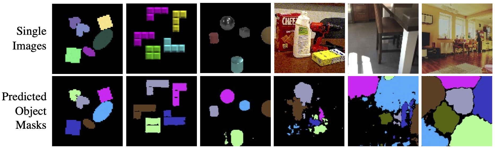

[](https://arxiv.org/abs/2208.07227)


## Promising or Elusive? Unsupervised Object Segmentation from Real-world Single Images (NeurIPS 2022)
[Yafei Yang](https://yangyafei1998.github.io/), [Bo Yang](https://yang7879.github.io/) <br/>
[**Paper**](https://arxiv.org/abs/2210.02324) | [**Project Page**](https://vlar-group.github.io/UnsupObjSeg.html)




## Overall Structure :earth_americas:
This repository contains:
* Complexity Factors Calculation for Datasets under `Complexity_Factors/`.
* Six Datasets Generation / Adaptation under `Dataset_Generation/`, including: 
    * dSprites;
    * Tetris;
    * CLEVR;
    * YCB;
    * ScanNet;
    * COCO.
* Four Representative Methods Re-implementation / Adaptation including:
    * AIR (["Attend, Infer, Repeat: Fast Scene Understanding with Generative Models"](https://arxiv.org/abs/1603.08575)) under `AIR/`;
    * MONet (["MONet: Unsupervised Scene Decomposition and Representation"](https://arxiv.org/abs/1901.11390)) under `MONet/`;
    * IODINE (["Multi-Object Representation Learning with Iterative Variational Inference"](https://arxiv.org/abs/1903.00450)) under `IODINE/`;
    * Slot Attention (["Object-Centric Learning with Slot Attention"](https://arxiv.org/abs/2006.15055)) under `Slot_Attention`.
* Evaluation of Object Segmentation Performance under `Segmentation_Evaluation/`, including:
    * AP score;
    * PQ score;
    * Precision and Recall.

## Preparation :construction_worker:
### 1. Create conda environment
```
conda env create -f [env_name].yml
conda activate [env_name]
```
Note: Since this repo consists of implementation of different approaches, we use seperate conda environments to manage them. Specifcally, use `tf1_env.yml` to build environment for **IODINE**, use `tf2_env.yml` to build environment for **Slot Attention** and use `pytorch_env.yml` for **AIR** and **MONet**.

### 2. Prepare datasets
#### 2.1 Dsprites dataset
Download raw dSprites shape data from https://github.com/deepmind/dsprites-dataset. Put downloaded `dsprites_ndarray_co1sh3sc6or40x32y32_64x64.npz` under `Dataset_Generation/dSprites`. \
Create our dSprite dataset using given shape data with: 
```
cd Dataset_Generation
python dSprites/create_dsprites_dataset.py --n_imgs [num_imgs] --root [dSprites_location] --min_object_count 2 --max_object_count 6
```
This will create `[num_imgs]` images and their corresponding masks under `[dSprites_location]/image` and `[dSprites_location]/mask`.

#### 2.2 Tetris Dataset
Download Tetrominoes dataset from https://github.com/deepmind/multi_object_datasets. Put downloaded `tetrominoes_train.tfrecords` under `Dataset_Generation/Tetris`.\
Parse tfrecord data into images with: 
```
cd Dataset_Generation
python Tetris/read_tetris_tfrecords.py
```
This will create 10000 images from tetrominoes dataset of resolution 35x35 under `Tetris/tetris_source` .\
Create our Tetris dataset using previously parsed images with:
```
python Tetris/create_tetris_dataset.py --n_imgs [num_imgs] --root [Tetris_location] --min_object_count 2 --max_object_count 6
```
This will create `[num_imgs]` images and their corresponding masks under `[Tetris_location]/image` and `[Tetris_location]/mask`.

#### 2.3 CLEVR Dataset
Clone and follow the instructions of repo https://github.com/facebookresearch/clevr-dataset-gen and render CLEVR images with:
```
cd image_generation
blender --background --python render_images.py -- --num_images [num_imgs] --min_objects 2 --max_objects 6
```
If you have an NVIDIA GPU with CUDA installed then you can use the GPU to accelerate rendering:
```
blender --background --python render_images.py -- --num_images [num_imgs] --min_objects 2 --max_objects 6 --use_gpu 1
```
Put rendered images and masks under `Dataset_Generation/CLEVR/clevr_source/images` and `Dataset_Generation/CLEVR/clevr_source/masks`. \
Create our CLEVR dataset using previously rendered images with: 
```
python CLEVR/create_clevr_dataset.py --n_imgs [num_imgs] --root [CLEVR_location] --min_object_count 2 --max_object_count 6
```
This will create `[num_imgs]` images and their corresponding masks under `[CLEVR_location]/image` and `[CLEVR_location]/mask`.
 
#### 2.4 YCB Dataset
Download 256-G video-YCB dataset from https://rse-lab.cs.washington.edu/projects/posecnn/. Put them under `Dataset_Generation/YCB/YCB_Video_Dataset`
Create our YCB dataset using raw video-YCB images with:
```
python YCB/create_YCB_dataset.py --n_imgs [num_imgs] --root [YCB_location] --min_object_count 2 --max_object_count 6
```
This will create `[num_imgs]` images and their corresponding masks under `[YCB_location]/image` and `[YCB_location]/mask`.

#### 2.5 ScanNet Dataset
Download ScanNet data and put it under `Dataset_Generation/ScanNet/scannet_raw`.
Process ScanNet data into `Dataset_Generation/ScanNet/scans_processed` with:
```
python ScanNet/process_scannet_data.py
```
This will parse 2d images from ScanNet sensor data, unzip raw 2d instance label (filterd version) in ScanNet and  parse the offical train/val split downloaded from: https://github.com/ScanNet/ScanNet/tree/master/Tasks/Benchmark.\
Create our ScanNet dataset using processed ScanNet data with: `
```
python COCO/create_ScanNet_dataset.py --n_imgs [num_imgs] --root [ScanNet_location] --min_object_count 2 --max_object_count 6
```
This will create `[num_imgs]` images and their corresponding masks under `[ScanNet_location]/image` and `[ScanNet_location]/mask`.

#### 2.6 COCO Dataset
Download COCO data from http://images.cocodataset.org/zips/val2017.zip (valdiation), http://images.cocodataset.org/zips/train2017.zip (train) and http://images.cocodataset.org/annotations/annotations_trainval2017.zip (annotations). Put them under `Dataset_Generation/COCO/COCO_raw`.\
Parse segmentation mask from annotation file with:
```
python COCO/process_coco_dataset.py
```
Create our COCO dataset using originl COCO images and parsed masks with: 
```
python YCB/create_ScanNet_dataset.py --n_imgs [num_imgs] --root [COCO_location] --min_object_count 2 --max_object_count 6
```
This will create `[num_imgs]` images and their corresponding masks under `[COCO_location]/image` and `[COCO_location]/mask`.

### 3. Create ablation datasets
* Use `Dataset_Generation/Ablation Dataset/object_level_ablation.py` to create datasets ablated on object level factors.
* Use `Dataset_Generation/Ablation Dataset/scene_level_ablation.py` to create datasets ablated on scene level factors.
* Use `Dataset_Generation/Ablation Dataset/joint_ablation.py` to create datasets ablated on both object and scene level factors.

Details examples and usages can be found in corresponding scripts.


## Launch Training :rocket:
### 1. AIR
Training:
```
cd AIR/
python main.py --dataset [dataset_name] --gpu_index [gpu_id] --max_steps 6 
```
Testing
```
cd AIR/
python main.py --dataset [dataset_name] --gpu_index [gpu_id] --eval_mode --resume [ckpt]
```
where:
- `dataset_name` is the name of the dataset, e.g. dSprites, YCB.
- `gpu_id` is the target cuda device id. 
- `ckpt` is the checkpoint to be resume in the testing stage.
- in all experiments for AIR, we set the `max_steps` to be 6.

### 2. MONet
Training:
```
cd MONet/
python main.py --dataset [dataset_name] --gpu_index [gpu_id] --K_steps 7 
```
Testing: 
```
cd MONet/
python main.py --dataset [dataset_name] --gpu_index [gpu_id] --K_steps 7 --eval_mode --resume [ckpt]
```
where:
- `dataset_name` is the name of the dataset, e.g. dSprites, YCB.
- `gpu_id` is the target cuda device id. 
- `ckpt` is the checkpoint to be resume in the testing stage.
- in all experiments for MONet, we set the `K_steps` to be 7.

### 3. IODINE
Training:
```
cd IODINE/
CUDA_VISIBLE_DEVICES=[gpu_id] python main.py -f with [dataset_name_train]
```
Testing:
```
cd IODINE/
CUDA_VISIBLE_DEVICES=[gpu_id] python eval.py --dataset_identifier [dataset_name_test]
```
where:
- `dataset_name_train` is the name of the trainining dataset, e.g. dSprites_train, YCB_train.
- `dataset_name_test` is the name of the testing dataset, e.g. dSprites_test, YCB_test.
- `gpu_id` is the target cuda device id. 

### 4. Slot Attention
Training:
```
cd Slot_Attention/
CUDA_VISIBLE_DEVICES=[gpu_id] python train.py --dataset [dataset_name] --num_slots 7 
```
Testing:
```
cd Slot_Attention/
CUDA_VISIBLE_DEVICES=[gpu_id] python eval.py --dataset [dataset_name] --num_slots 7 
```
where:
- `dataset_name` is the name of the dataset, e.g. dSprites, YCB.
- `gpu_id` is the target cuda device id. 
- in all experiments for Slot Attention, we set the `num_slots` to be 7.


## Complexity factors for datasets :bar_chart:
Calculate object-level and scene-level complexity factors with `Complexity_Factors/Complexity_Factor_Evaluator.py`. Examples are provided in that script.

## Visualization :eyes:


## Citation
If you find our work useful in your research, please consider citing:

      @article{yang2022,
      title={Promising or Elusive? Unsupervised Object Segmentation from Real-world Single Images},
      author={Yang, Yafei and Yang, Bo},
      journal={NeurIPS},
      year={2022}
    }

## Updates
* 5/10/2022: Initial release！

## Acknowledgement :bulb:
This project references the following repositories:
* https://pyro.ai/examples/air.html
* https://github.com/addtt/attend-infer-repeat-pytorch
* https://github.com/applied-ai-lab/genesis
* https://github.com/deepmind/deepmind-research/tree/master/iodine
* https://github.com/google-research/google-research/tree/master/slot_attention
